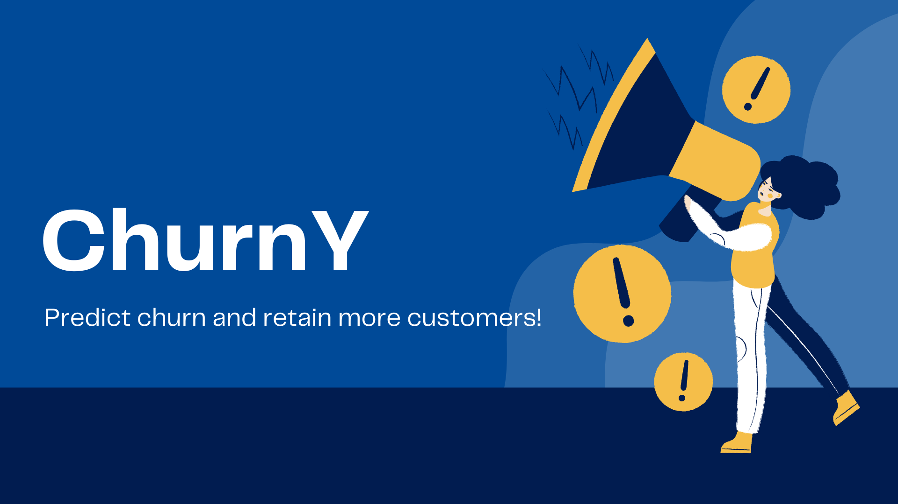

<div id="top"></div>

<!-- PROJECT LOGO -->
<br />
<div align="center">
  <a href="https://github.com/othneildrew/Best-README-Template">
    
  </a>

</div>


# ChurnY : A Customer Churn Predictor


<!-- ABOUT THE PROJECT -->
## About The Project
__ChurnY__ is a REST API service for customer churn prediction. It can predict the likelihood of churn using customer data such as customer demographics, subscription history, and behaviors.

Using ChurnY, it is possible to get an early warning of a potential customer churn,  so we can efficiently target certain customers and develop a more focused customer retention strategies 


<p align="right">(<a href="#top">back to top</a>)</p>


### Technologies 

This service is built using the following frameworks/libraries:

* [Flask](https://flask.palletsprojects.com/en/2.0.x/)
* [Gunicorn](https://gunicorn.org/)
* [Scikit-learn](https://scikit-learn.org/stable/#)
* [Pandas](https://pandas.pydata.org/)
* [Numpy](https://numpy.org/)

<p align="right">(<a href="#top">back to top</a>)</p>


<!-- USAGE -->
## Usage


### Run the server


1. Build a docker image

    ```sh
    docker build -t churn .
    ```
2. Run the docker container

   ```sh
   docker run -it -rm -p 9696:9696 churn
   ```

### Sending a request
1. Please refer to the [request.py](https://github.com/ryzary/customer_churn/blob/main/request.py) file. It contains an input example. 
Then, execute this script after running the server.

    ```sh
    python3 request.py
    ```
2. The response is a json file containing the churn prediction.

    ```sh
    {'Churn Probability': 0.014, 'churn': False}
    ```


<p align="right">(<a href="#top">back to top</a>)</p>


<!-- ABOUT THE ML Model -->
## Machine Learning Model Building
### Dataset
The dataset used in for building the ML model is the [Telco Customer Churn Dataset](https://www.kaggle.com/blastchar/telco-customer-churn). It contains the following information:
- Customers who left within the last month (Churn)
- Services that each customer has signed up for – phone, multiple lines, internet, online security, online backup, device protection, tech support, and streaming TV and movies
- Customer account information – how long they’ve been a customer, contract, payment method, paperless billing, monthly charges, and total charges
- Demographic info about customers – gender, age range, and if they have partners and dependents

### Exploratory Data Analysis (EDA)
Please refer to this [notebook](https://github.com/ryzary/customer_churn/blob/main/EDA.ipynb) for EDA.

### Feature Encoding
The categorical features were encoded using scikit-learn's [DictVectorizer](https://scikit-learn.org/stable/modules/generated/sklearn.feature_extraction.DictVectorizer.html).

The complete list of features used for ML model building can be checked in this [file](https://github.com/ryzary/customer_churn/blob/main/training.py).

### Model Training and Hyperparameter Tuning
- A Random Forest and Logistic Regression models were trained and tuned. [GridSearchCV](https://scikit-learn.org/stable/modules/generated/sklearn.model_selection.GridSearchCV.html) was used for hyperparameter tuning.
- To compare the model performance (ROC-AUC scores), 10-folds Stratified Cross Validation was performed.
- The logistic regression model showed a slightly higher score (AUC=0.8431) than the Random Forest model (AUC=0.8428).
- Therefore, the logistic regression model was used for deployment. Another reason of choosing the Logistic Regression over the Random Forest model is due to its interpretability.


<!-- CONTACT -->
## Contact

Ryza Rynazal [Linkedin](https://www.linkedin.com/in/ryza-rynazal/) 


<!-- ACKNOWLEDGMENTS -->
## Acknowledgments

This project was taught by Alexey Grigorev during  the Zoomcamp held by DataTalksClub .

* [ML Zoomcamp by DataTalksClub](https://www.youtube.com/watch?v=rowoDjPc8HU&ab_channel=DataTalksClub)


<p align="right">(<a href="#top">back to top</a>)</p>


